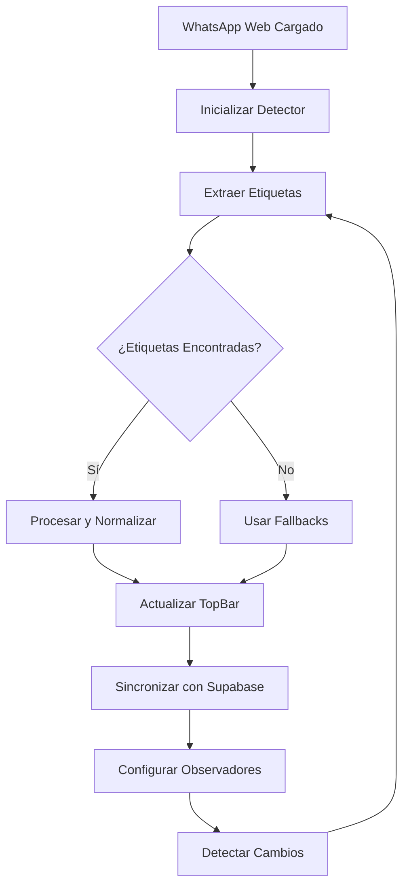

# Extracción de Etiquetas de WhatsApp Business

## Descripción

Esta funcionalidad permite al CRM de WhatsApp extraer automáticamente las etiquetas (labels) creadas en WhatsApp Business directamente desde la base de datos IndexedDB local, sin necesidad de que el usuario tenga que abrir manualmente los chats etiquetados.

## Características Principales

### 🏷️ Detección Automática de Etiquetas
- **Extracción desde IndexedDB**: Accede directamente a la base de datos local de WhatsApp Web
- **Múltiples estrategias**: Utiliza diferentes métodos de detección para maximizar el éxito
- **Detección en tiempo real**: Observa cambios y actualiza automáticamente las etiquetas
- **Sincronización con Supabase**: Guarda las etiquetas extraídas en la base de datos remota

### 🔍 Estrategias de Detección

El sistema utiliza múltiples estrategias para encontrar etiquetas:

1. **IndexedDB**: Busca en las bases de datos de WhatsApp Web
2. **DOM Scanning**: Analiza elementos visuales en la página
3. **LocalStorage**: Examina el almacenamiento local del navegador
4. **CSS Analysis**: Identifica etiquetas a través de estilos CSS
5. **Dynamic Content**: Observa contenido que se carga dinámicamente

### 📊 Información Extraída

Para cada etiqueta detectada se obtiene:
- **ID único**: Identificador de la etiqueta
- **Nombre**: Texto de la etiqueta
- **Color**: Color asignado en formato hexadecimal
- **Uso**: Frecuencia de uso (si está disponible)
- **Tipo**: Si es predefinida o personalizada
- **Origen**: Fuente de donde se extrajo la etiqueta

## Implementación Técnica

### Componentes Principales

1. **WhatsAppLabelsService** (`services/whatsappLabelsService.js`)
   - Servicio principal que coordina la extracción
   - Maneja la sincronización con Supabase
   - Observa cambios en tiempo real

2. **WhatsAppBusinessDetector** (`utils/whatsappDetector.js`)
   - Detector avanzado con múltiples estrategias
   - Análisis profundo de IndexedDB
   - Extracción desde DOM y estilos CSS

3. **TopBar Integration** (`topbar.js`)
   - Muestra las etiquetas extraídas en la interfaz
   - Permite filtrado por etiquetas
   - Sincronización automática

### Flujo de Trabajo



## Configuración

### 1. Configuración de Supabase

Las etiquetas extraídas se sincronizan automáticamente con Supabase. Asegúrate de que tu tabla `tags` tenga la siguiente estructura:

```sql
CREATE TABLE IF NOT EXISTS tags (
    id UUID DEFAULT gen_random_uuid() PRIMARY KEY,
    user_id UUID REFERENCES auth.users(id) ON DELETE CASCADE,
    name VARCHAR(255) NOT NULL,
    color VARCHAR(7) NOT NULL,
    whatsapp_label_id VARCHAR(255),
    source VARCHAR(50) DEFAULT 'manual',
    usage_count INTEGER DEFAULT 0,
    created_at TIMESTAMP WITH TIME ZONE DEFAULT NOW(),
    updated_at TIMESTAMP WITH TIME ZONE DEFAULT NOW()
);
```

### 2. Permisos Requeridos

El `manifest.json` debe incluir los siguientes permisos:

```json
{
  "permissions": [
    "storage",
    "activeTab",
    "scripting"
  ],
  "host_permissions": [
    "https://web.whatsapp.com/*",
    "https://*.supabase.co/*"
  ]
}
```

## Uso

### Detección Automática

La detección se ejecuta automáticamente cuando:
- Se carga WhatsApp Web
- Se detectan cambios en el DOM
- Se ejecuta sincronización periódica (cada 30 segundos)

### Acceso Manual

```javascript
// Obtener el servicio de etiquetas
const labelsService = window.whatsappCRMTopBar?.whatsappLabelsService;

// Extraer etiquetas manualmente
const labels = await labelsService.getLabels();

// Forzar nueva detección
const newLabels = await labelsService.refreshLabels();

// Sincronizar con Supabase
await labelsService.syncWithSupabase(supabaseClient, userId);
```

### Configuración del Detector

```javascript
// Crear detector personalizado
const detector = new WhatsAppBusinessDetector();

// Usar estrategias específicas
const labels = await detector.detectLabels(['indexeddb', 'dom']);

// Obtener información de caché
const cachedLabels = detector.getCachedLabels();
const lastDetection = detector.getLastDetectionTime();
```

## Monitoreo y Debugging

### Logs de Consola

El sistema proporciona logs detallados:

```javascript
// Logs del servicio principal
[WhatsAppLabels] 🚀 Inicializando servicio de etiquetas de WhatsApp...
[WhatsAppLabels] ✅ Servicio de etiquetas inicializado correctamente
[WhatsAppLabels] 📊 Procesadas 5 etiquetas

// Logs del detector
[WA Detector] 🔍 Iniciando detección de etiquetas con estrategias: indexeddb, dom
[WA Detector] ✅ indexeddb: 3 etiquetas encontradas
[WA Detector] 🏆 Detección completada: 5 etiquetas únicas encontradas

// Logs del TopBar
[TopBar] 🏷️ Etiquetas de WhatsApp Business: Array(5)
[TopBar] 🔄 Sincronizando etiquetas con Supabase...
[TopBar] ✅ Etiquetas sincronizadas exitosamente con Supabase
```

### Función de Debug

```javascript
// Ejecutar debug manual
window.debugWhatsAppCRM();

// Información específica de etiquetas
console.log('Etiquetas detectadas:', window.whatsappCRMTopBar?.whatsappLabelsService?.labels);
```

## Estructura de Datos

### Formato de Etiqueta

```javascript
{
  id: "wab_1703123456789_abc123def",
  name: "Cliente VIP",
  color: "#8b5cf6",
  predefined: false,
  usage_count: 8,
  created_at: "2024-12-21T10:30:00.000Z",
  source: "whatsapp_business",
  source_store: "wam",
  source_path: "labels.business[0]"
}
```

### Estados de Sincronización

- **Detectada**: Etiqueta encontrada pero no sincronizada
- **Sincronizada**: Etiqueta guardada en Supabase
- **Actualizada**: Etiqueta modificada y re-sincronizada
- **Error**: Problema en la sincronización

## Limitaciones y Consideraciones

### Limitaciones Técnicas

1. **Acceso a IndexedDB**: Depende de la estructura interna de WhatsApp Web
2. **Permisos del Navegador**: Requiere permisos de storage y scripting
3. **Cambios en WhatsApp**: La estructura puede cambiar con actualizaciones
4. **Rendimiento**: La detección completa puede tomar algunos segundos

### Mejores Prácticas

1. **Monitoreo**: Revisar logs para detectar problemas
2. **Fallbacks**: El sistema siempre tiene datos mock como respaldo
3. **Sincronización**: Verificar que Supabase esté configurado correctamente
4. **Actualizaciones**: Mantener el código actualizado con cambios de WhatsApp

## Troubleshooting

### Problemas Comunes

**No se detectan etiquetas**
- Verificar que WhatsApp Business esté configurado
- Comprobar permisos de la extensión
- Revisar logs de consola para errores

**Error de sincronización con Supabase**
- Verificar configuración de Supabase
- Comprobar autenticación del usuario
- Revisar estructura de la tabla `tags`

**Etiquetas duplicadas**
- El sistema tiene deduplicación automática
- Si persiste, limpiar caché local

### Soluciones

```javascript
// Limpiar caché y redetectar
const detector = new WhatsAppBusinessDetector();
await detector.refreshDetection();

// Forzar sincronización
const labelsService = window.whatsappCRMTopBar?.whatsappLabelsService;
await labelsService.syncWithSupabase(supabaseClient, userId);

// Reinicializar completamente
window.location.reload();
```

## Futuras Mejoras

### Funcionalidades Planificadas

1. **API de WhatsApp Business**: Integración directa con la API oficial
2. **Detección de Red**: Interceptar llamadas de red para encontrar etiquetas
3. **Machine Learning**: Detección inteligente de patrones de etiquetas
4. **Exportación**: Exportar etiquetas a diferentes formatos
5. **Importación**: Importar etiquetas desde archivos externos

### Optimizaciones

1. **Caché Inteligente**: Mejorar el sistema de caché
2. **Detección Incremental**: Solo detectar cambios nuevos
3. **Compresión**: Optimizar almacenamiento de datos
4. **Paralelización**: Ejecutar estrategias en paralelo

## Contribuciones

Para contribuir a esta funcionalidad:

1. **Fork** el repositorio
2. **Crear** una rama para la nueva funcionalidad
3. **Implementar** mejoras siguiendo los patrones existentes
4. **Probar** con diferentes configuraciones de WhatsApp Business
5. **Documentar** los cambios realizados
6. **Enviar** pull request con descripción detallada

## Soporte

Para soporte técnico:
- Revisar logs de consola
- Verificar configuración de Supabase
- Consultar documentación de WhatsApp Business
- Reportar problemas con logs completos 